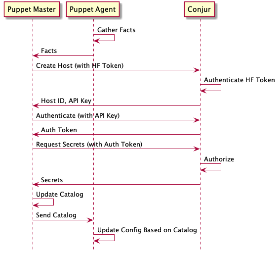
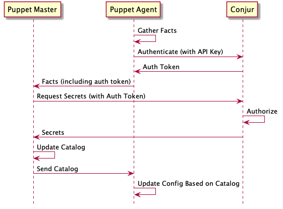
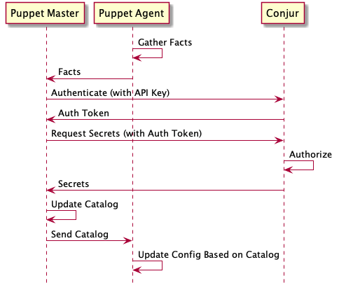

# Contributing

For general contribution and community guidelines, please see the [community repo](https://github.com/cyberark/community).

- [Development](#development)
  * [Sequence diagrams](#sequence-diagrams)
  * [Running a Conjur server locally](#running-a-conjur-server-locally)
  * [Running a Puppet master locally](#running-a-puppet-master-locally)
  * [Running a Puppet node locally](#running-a-puppet-node-locally)
- [Testing](#testing)
- [Releases](#releases)
- [Contributing](#contributing)

<small><i><a href='http://ecotrust-canada.github.io/markdown-toc/'>Table of contents
generated with markdown-toc</a></i></small>

## Development

### Sequence diagrams

It may help to understand some typical flows when this Puppet module is
included in your Puppet workflows. The following Conjur Puppet module
workflows are portrayed below:

- [Using Conjur Host Identity with Host Factory](#using-conjur-host-identity-with-host-factory)
- [Using Windows Registry / Windows Credential Manager Pre-Provisioning](#using-windows-registry--windows-credential-manager-pre-provisioning)
- [Using Host Identity with API Key Configured in Puppet Manifest](#using-host-identity-with-api-key-configured-in-puppet-manifest)

#### Using Conjur Host Identity with Host Factory

This workflow is described in the
[Conjur host factory](README.md#conjur-host-factory)
section in the [README.md](README.md) file.

##### Initial Use of HFT:


Diagram Source: [host_factory_workflow.txt](diagrams/host_factory_workflow.txt)

##### Consequent Use of HFT:


Diagram Source: [host_factory_workflow2.txt](diagrams/host_factory_workflow2.txt)

##### References

- [Puppet Forge documentation](https://forge.puppet.com/conjur/conjur#conjur-host-identity-with-host-factory)
- [Configuration documentation](README.md#conjur-host-factory)

##### Puppet Configuration

- [Puppet Manifest Configuration](README.md#updating-the-puppet-manifest-1) 
- [Using Hiera](README.md#using-hiera-1) 

#### Using Windows Registry / Windows Credential Manager Pre-Provisioning

This workflow is described in the
[Using Windows Registry / Windows Credential Manager (Windows agents only)](README.md#using-windows-registry--windows-credential-manager-windows-agents-only)
section in the [README.md](README.md) file.



Diagram Source: [windows_pre_provision_workflow.txt](diagrams/windows_pre_provision_workflow.txt)

##### References

- [Puppet Forge documentation](https://forge.puppet.com/conjur/conjur#pre-established-host-identity)
- [Configuration documentation](README.md#using-windows-registry--windows-credential-manager-windows-agents-only)

##### Puppet Configuration

###### Puppet Manifest on Master

File: /etc/puppetlabs/code/environments/production/manifests/site.pp

```
  node default {
    include conjur
  }
```

###### Windows Puppet Agent Configuration

Conjur connection information and the node's Conjur API key can be configured
using the PowerShell scripts described in the
[Using Windows Registry / Windows Credential Manager](README.md#using-windows-registry--windows-credential-manager-windows-agents-only)
section of the [README.md](README.md) file.

#### Using Host Identity with API Key Configured in Puppet Manifest

This workflow is described in the
[Conjur host identity with API key](README.md#conjur-host-identity-with-api-key)
section in the [README.md](README.md) file.



Diagram Source: [host_id_with_api_key_workflow.txt](diagrams/host_id_with_api_key_workflow.txt)

##### References

- [Puppet Forge documentation](https://forge.puppet.com/conjur/conjur#conjur-host-identity-with-api-key)

##### Puppet Configuration

- [Puppet Manifest Configuration](README.md#updating-the-puppet-manifest) 
- [Using Hiera](README.md#using-hiera) 

### Running a Conjur server locally

Run a preconfigured Conjur instance with `docker-compose up -d`.
Username is 'admin', password is 'ADmin123!!!!'. The HTTPS endpoint is mapped to port `9443`.
Once the server is running, view the UI at [localhost:9443/ui](https://localhost:9443/ui).
You can ignore the cert warning; a self-signed cert is used.

### Running a Puppet master locally

Run a Puppet master with `./puppet-master.sh`. This script wraps running `docker-compose.puppet.yml`, where
all services needed to run the master are defined. The `code` directory in this project is mounted
onto the master at `/etc/puppetlabs/code/`. Open [localhost:8080](http://localhost:8080) to view the Puppet Dashboard.
You can stop and remove all services with `docker-compose -f docker-compose.puppet.yml down`.

### Running a Puppet node locally

Puppet [provides Docker images](https://github.com/puppetlabs/puppet-in-docker#description)
that make running ephemeral Puppet agents pretty easy.

For example, once the Puppet master is up you can run this to converge an agent:

```sh-session
$ docker run --rm --net puppet_default puppet/puppet-agent-ubuntu
```

You will see Puppet converge on the node.

A couple notes:

1. docker-compose creates the `puppet_default` network by default. The agent needs to connect to this
   network to be able to see the Puppet master.
2. The default command for these agent images is `agent --verbose --one-time --no-daemonize --summarize`.
   The default entrypoint is `/opt/puppetlabs/bin/puppet `.
   This can easily be overridden for your purposes, e.g.

   ```sh-session
   $ docker run --rm --net puppet_default \
     puppet/puppet-agent-ubuntu apply --modulepath=$PWD examples/init.pp
   ```

Note that if you want to run manifests directly then need to be mounted into the container.

## Testing

See [jenkins.sh](jenkins.sh).

## Releases

To release a new version of the module to the Puppet Forge:

1. Update the `version` field in [metadata.json](metadata.json).
2. Update [CHANGELOG.md](CHANGELOG.md).
3. Commit and push these changes to a branch, and create a PR.
4. Once the PR is approved, create an annotated tag on the main branch and push
   it (`git tag -a <VERSION> -m <VERSION> && git push --tags`)
5. Verify the Jenkins pipeline completes successfully.
6. Verify the updated module on [Puppet Forge](https://forge.puppet.com/cyberark/conjur).

## Running a Puppet master and Windows-based Puppet node locally

The [examples/puppetmaster/vagrant](examples/puppetmaster/vagrant) directory
contains Vagrantfiles, Bash scripts, and PowerShell scripts that can be used
to create a Vagrant/VirtualBox-based development and test environment for
testing the Conjur Puppet module with Puppet Agents running on Windows2016
or Windows2012.

These Vagrantfiles and scripts can be used to:

- Spin up a containerized Puppet Server and Conjur server via docker-compose.
- Create a Windows2016 or Windows2012 VM.
- Dynamically install the desired version of Puppet Agent on the VM.
- Run Puppet Agent on the VM to install a Puppet catalog.
- Confirm that Puppet has been provisioned according to the configured
  Puppet manifest on the Puppet master.

For details, refer to
[examples/puppetmaster/vagrant/README.md](examples/puppetmaster/vagrant/README.md).

## Contributing

1. [Fork the project](https://help.github.com/en/github/getting-started-with-github/fork-a-repo)
2. [Clone your fork](https://help.github.com/en/github/creating-cloning-and-archiving-repositories/cloning-a-repository)
3. Make local changes to your fork by editing files
3. [Commit your changes](https://help.github.com/en/github/managing-files-in-a-repository/adding-a-file-to-a-repository-using-the-command-line)
4. [Push your local changes to the remote server](https://help.github.com/en/github/using-git/pushing-commits-to-a-remote-repository)
5. [Create new Pull Request](https://help.github.com/en/github/collaborating-with-issues-and-pull-requests/creating-a-pull-request-from-a-fork)

From here your pull request will be reviewed and once you've responded to all
feedback it will be merged into the project. Congratulations, you're a
contributor!
