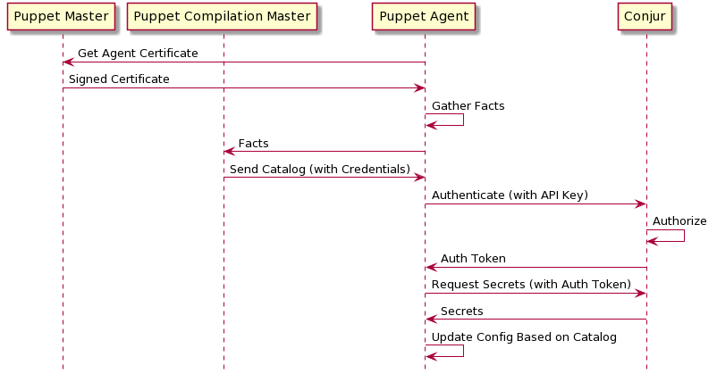
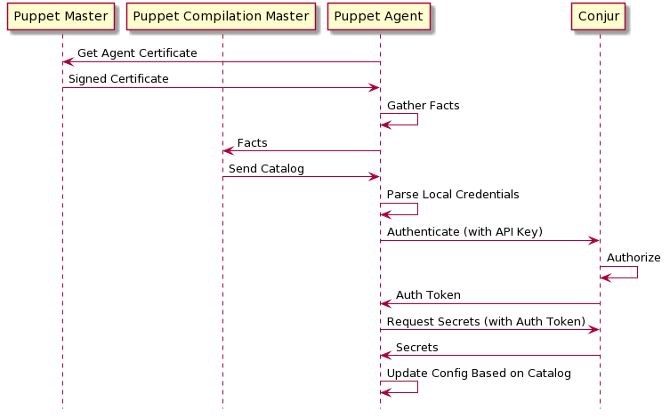

# Contributing

For general contribution and community guidelines, please see the [community repo](https://github.com/cyberark/community).

- [Development](#development)
  + [Sequence diagrams](#sequence-diagrams)
    - [Manifest-Provided Identity](#manifest-provided-identity)
    - [Pre-Provisioned Identity](#pre-provisioned-identity)
  + [Running a test environment](#running-a-test-environment)
  + [Running a Puppet node locally](#running-a-puppet-node-locally)
  + [Running a Puppet master and Windows-based Puppet node locally](#running-a-puppet-master-and-windows-based-puppet-node-locally)
- [Testing](#testing)
- [Generating the documentation](#generating-the-documentation)
- [Releases](#releases)
  + [Verify and update dependencies](#verify-and-update-dependencies)
  + [Publishing a Release](#publishing-a-release)
- [Pull request workflow](#pull-request-workflow)

## Development

### Sequence diagrams

It may help to understand some typical flows when this Puppet module is
included in your Puppet workflows. The following Conjur Puppet module
workflows are portrayed below:

- [Manifest-provided Identity](#manifest-provided-identity)
- [Pre-Provisioned Identity](#pre-provisioned-identity)

#### Manifest-Provided Identity

This workflow is described in the
[Updating the Puppet manifest](README.md#updating-the-puppet-manifest)
section in the [README.md](README.md) file.



#### Pre-Provisioned Identity

This workflow is described in the
["Using Conjur identity files (Linux agents only)"](README.md#using-conjur-identity-files--linux-agents-only-)
and
["Using Windows Registry / Windows Credential Manager (Windows agents only)"](README.md#using-windows-registry---windows-credential-manager--windows-agents-only-)
sections of the [README.md](README.md) file.



### Running a test environment

Run a pre-configured Conjur and Puppet master instance by going into the
`examples/puppetmaster` folder and running the following:
```sh
export CLEAN_UP_ON_EXIT=false
export INSTALL_PACKAGED_MODULE=false
export COMPOSE_PROJECT_NAME=puppetmaster_manual
./test.sh
```

This command will run the integration tests and exit with the Puppet master and
Conjur instances still available.

### Running a Puppet node locally

After you have your test environment up, you can test changes using pre-built
[agent images](https://github.com/puppetlabs/puppet-in-docker#description)
that makes the test cycle really fast.

For example, once the Puppet master is up you can run this to converge an agent:
```sh
# Get IP of docker-compose gateway. This only needs to be run once.
export DOCKER_GATEWAY_IP="$(docker inspect $(docker-compose ps -q puppet) | \
    jq .[0].NetworkSettings.Networks[].Gateway | tr -d '"')"

# Run the agent
docker run --rm -it \
    --net puppetmaster_manual_default \
    --add-host "conjur.cyberark.com:$DOCKER_GATEWAY_IP" \
    --hostname "my-agent-name" \
    "ghcr.io/openvoxproject/openvoxagent"
```

You will see Puppet converge on the node.

A couple notes:

1. `docker-compose` creates the `$COMPOSE_PROJECT_NAME_default` network by default.
  The agent needs to connect to this network to be able to see the Puppet master
  and Conjur.
2. The default command for these agent images is `agent --verbose --one-time --no-daemonize --summarize`.
   The default entrypoint is `/opt/puppetlabs/bin/puppet `.
   This can be overridden for your purposes with CLI parameters:

   ```sh-session
   $ docker run --rm -it \
                --net puppetmaster_manual_default \
                --add-host "conjur.cyberark.com:$DOCKER_GATEWAY_IP" \
                --hostname 'test-machine' \
                puppet_default \
                puppet/puppet-agent-ubuntu agent --trace \
                                                 --one-time \
                                                 --no-daemonize \
                                                 --certname 'myhost.com'
   ```

### Running a Puppet master and Windows-based Puppet node locally

The [examples/puppetmaster/vagrant](examples/puppetmaster/vagrant) directory
contains Vagrantfiles, Bash scripts, and PowerShell scripts that can be used
to create a Vagrant/VirtualBox-based development and test environment for
testing the Conjur Puppet module with Puppet Agents running on Windows2016
or Windows2012.

These Vagrantfiles and scripts can be used to:

- Spin up a containerized Puppet Server and Conjur server via docker-compose.
- Create a Windows2016 or Windows2012 VM.
- Dynamically install the desired version of Puppet Agent on the VM.
- Run Puppet Agent on the VM to install a Puppet catalog.
- Confirm that Puppet has been provisioned according to the configured
  Puppet manifest on the Puppet master.

For details, refer to
[examples/puppetmaster/vagrant/README.md](examples/puppetmaster/vagrant/README.md).

## Testing

Run the following at the base of the project:

```sh-session
$ ./ci/test.sh
```

This script leverages PDK to run both unit tests and validations of the module.

## Generating the documentation

To (re)generate the documentation, you just need to run `./ci/gen-docs.sh` from the root of the
project and commit the changes.

## Releases

### Verify and update dependencies

1. Check for files added since last release and any modules that are newly
   linked from code or used that were not written by CyberArk employees. Keep
   in mind that dependency module version changes count as new modules.

1. If any module(s) from that list does not have a matching entry in the
   NOTICES.txt file you should add (or update) its version and license/copyright
   in NOTICES.txt.

1. If any external modules are no longer linked to or an external dependency removed
   from source, remove that version of the software and its license/copyright from
   NOTICES.txt.

If no dependencies have changed, you can move on to the next step.

### Publishing a Release

To release a new version of the module to the Puppet Forge:

1. Update the `version` field in [metadata.json](metadata.json).
2. Update [CHANGELOG.md](CHANGELOG.md).
3. Verify that nothing changed in the `REFERENCE.md` by
   [regenerating the docs](#generating-the-documentation).
4. Commit and push these changes to a branch, and create a PR.
5. Once the PR is approved, create an annotated tag on the main branch and push
   it (`git tag -a <VERSION> -m <VERSION> && git push --tags`)
6. Verify the Jenkins pipeline completes successfully.
7. Verify the updated module on [Puppet Forge](https://forge.puppet.com/cyberark/conjur).

## Pull Request Workflow

1. Search the [open issues](issues) in GitHub to find out what has been planned
2. Select an existing issue or open an issue to propose changes or fixes
3. Add the `implementing` label to the issue as you begin to work on it
4. Run tests as described [here](#testing), ensuring they pass
5. Submit a pull request, linking the issue in the description (e.g. `Connected to #123`)
6. Add the `implemented` label to the issue, and ask another contributor to review and merge your code
